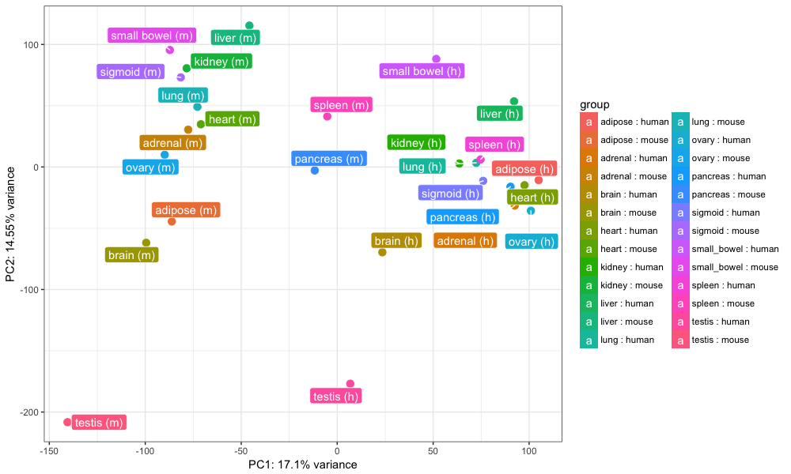
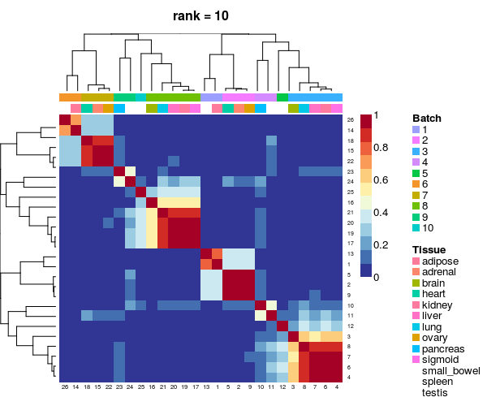
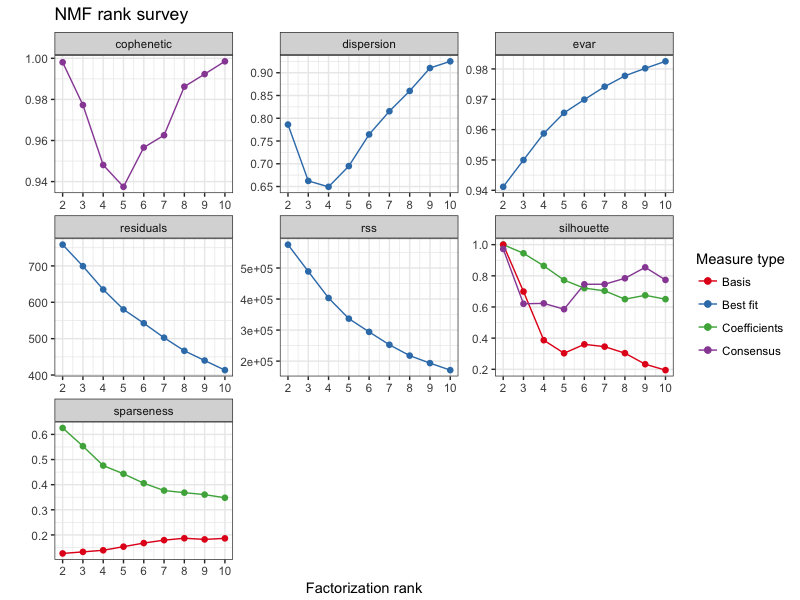
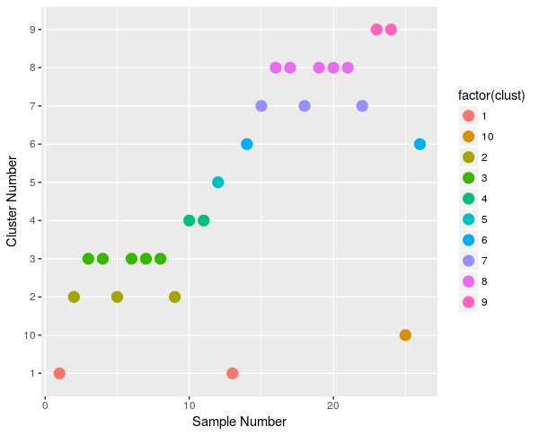

<br>
**Package**: `r Rpackage("DASC")`<br />
**Authors**: `r packageDescription("DASC")[["Author"]]` <br />
**Version**: `r packageDescription("DASC")[["Version"]]`<br />
**Compiled date**: `r Sys.Date()`<br />
**License**: `r packageDescription("DASC")[["License"]]`<br />
**Prerequisites**: NMF, cvxclustr, Biobase <br />

```{r style, echo = FALSE, results = 'asis'}
BiocStyle::markdown()
```

```{r setup, echo=FALSE, message=FALSE}
library(knitr)
opts_chunk$set(comment=NA, fig.align="center", warning=FALSE)

## Libraries
require(Biobase)
require(NMF)
require(cvxclustr)
```

# Getting started

`r Biocpkg("DASC")` is an R package distributed as part of the 
[Bioconductor](http://bioconductor.org) project. To install the package, start 
R and enter:

```{r installation, eval=FALSE}
source("http://bioconductor.org/biocLite.R")
biocLite("DASC")
```

# Introduction

`r Biocpkg("DASC")` is used for identifying batches and classifying samples 
into different batches in a high dimensional gene expression dataset. The batch 
information can be further used as a covariate in conjunction with other 
variables of interest among standard bioinformatics analysis like differential 
expression analysis.

## Citation info

If you use `r Biocpkg("DASC")` for your analysis, please cite it as here below. 
To cite package ‘DASC’ in publications use:

```
    @Manual{, 
        title = {DASC: Detecting hidden batch factors through data adaptive 
            adjustment for biological effects.},
        author = {Haidong Yi, Ayush T. Raman, Han Zhang, Genevera I. Allen and 
            Zhandong Liu},
        year = {2017},
        note = {R package version 0.1.0},
    }
```

# Quick Example

```{r, message=FALSE, eval=TRUE}
library(DASC)
data("esGolub")
samples <- c(20,21,28,30)
dat <- exprs(esGolub)[1:100,samples]
pdat <- pData(esGolub)[samples,]

## use nrun = 50 or more for better convergence of results
res <- DASC(edata = dat, pdata = pdat, factor = pdat$Cell, 
                        method = 'ama', type = 3, lambda = 1, 
                        rank = 2:3, nrun = 5, annotation='esGolub Dataset')
```

# Setting up the data

The first step in using `DASC` package is to properly format the data. For 
example, in case of gene expression data, it should be a matrix with features 
(genes, transcripts) in the rows and samples in the columns. `DASC` then 
requires the information for the variable of interest to model the gene 
expression data effectively.Variable of interest could be a genotype or 
treatment information.

## Stanford RNA-Seq Dataset

Below is an example of Stanford gene expression dataset (Chen et. al. PNAS, 
2015; Gilad et. al. F1000 Research, 2015). It is a filtered raw counts dataset 
which was published by Gilad et al. F1000 Research. 30% of genes with the 
lowest expression & mitochondrial genes were removed (Gilad et al.F1000 
Research).

```{r, message=FALSE, eval=TRUE}
## libraries
set.seed(99999)
library(DESeq2)
library(ggplot2)
library(pcaExplorer)

## dataset
rawCounts <- stanfordData$rawCounts
metadata <- stanfordData$metadata
```

```{r, message=FALSE, eval=TRUE}
## Using a smaller dataset
idx <- which(metadata$tissue %in% c("adipose", "adrenal", "sigmoid"))
rawCounts <- rawCounts[,idx]
metadata <- metadata[idx,]
```

```{r, message=FALSE, eval=TRUE}
head(rawCounts)
head(metadata)
```

# Batch detection using PCA Analysis

```{r, message=FALSE, eval=TRUE}
## Normalizing the dataset using DESeq2
dds <- DESeqDataSetFromMatrix(rawCounts, metadata, design = ~ species+tissue)
dds <- estimateSizeFactors(dds)
dat <- counts(dds, normalized = TRUE)
lognormalizedCounts <- log2(dat + 1)
```

```{r, message=FALSE, eval=TRUE}
## PCA plot using 
rld.dds <- rlog(dds)
pcaplot(rld.dds, intgroup=c("tissue","species"), ntop=1000, pcX=1, pcY=2)
```

In the PCA plot, PC1 shows the differences between the species. PC2 shows the 
differences between the species i.e. samples clustering based on tissues.

# Batch detection using DASC

```{r, message=FALSE, eval=TRUE}
res <- DASC(edata = dat, pdata = metadata, factor = metadata$tissue,
                method = 'ama', type = 3, lambda = 1, rank = 2:3, nrun = 10,
                annotation = 'Stanford Dataset')
```

```{r, message=FALSE, eval=TRUE}
## Consensus plot
consensusmap(res)
```

```{r, message=FALSE, eval=TRUE}
## Residual plot
plot(res)
```

```{r, message=FALSE, eval=TRUE}
## Batches -- dataset has 6 batches
sample.clust <- data.frame(sample.name = colnames(lognormalizedCounts), 
                            clust = as.vector(predict(res$fit$`2`)), 
                            batch = metadata$seqBatch)
ggplot(data = sample.clust, aes(x=c(1:6), y=clust, color=factor(clust))) + 
    geom_point(size = 4) + xlab("Sample Number") + ylab("Cluster Number")
```

Based on the above plots, we observe that the dataset has 2 batches. This can 
further be compared with the sequencing platform or `metadata$seqBatch`. The 
results suggest that differences in platform led to batch effects. Batch number 
can be used as another covariate, when differential expression analyses using 
`DESeq2`,`edgeR` or `limma` are performed.

# Analysis on entire Stanford Dataset

```{r, message=FALSE, eval=FALSE}

## not running this part of the code for building package
## Using entire dataset
rawCounts <- stanfordData$rawCounts
metadata <- stanfordData$metadata
dds <- DESeqDataSetFromMatrix(rawCounts, metadata, design = ~ species+tissue)
dds <- estimateSizeFactors(dds)
dat <- counts(dds, normalized = TRUE)
lognormalizedCounts <- log2(dat + 1)

## PCA Plot
rld.dds <- rlog(dds)
pcaplot(rld.dds, intgroup=c("tissue","species"), ntop = nrow(rld.dds), 
        pcX = 1, pcY = 2)

## Running DASC
res <- DASC(edata = dat, pdata = metadata, factor = metadata$tissue,
                method = 'ama', type = 3, lambda = 1, rank = 2:10,
                nrun = 100, annotation = 'Stanford Dataset')

## Consensus plot
consensusmap(res)

## Residual plot
plot(res)

## Clustering samples based on batches
sample.clust <- data.frame(sample.name = colnames(lognormalizedCounts), 
                            clust = as.vector(predict(res$fit$`10`)), 
                            batch = metadata$seqBatch)
ggplot(data = sample.clust, aes(x=c(1:26), y=clust, color=factor(clust))) + 
    geom_point(size = 4) + xlab("Sample Number") + ylab("Cluster Number")
```

```{r, out.width = "800px", echo=FALSE}




```

Based on the PCA plot, we see the PC1 captures the differences based on 
species. Based on `consensusmap` plot and Cophenetic & dispersion values, there 
are 10 batches in the dataset. Our results show that the batches are not only
due to platform but due other reason like differences in the date and the time 
of library preparation and sequencing of the samples. Another important
observation, is that at rank equal to 2, we observe entire dataset to cluster 
based on speicies.

# Session Info

```{r, message=FALSE}
sessionInfo()
```

